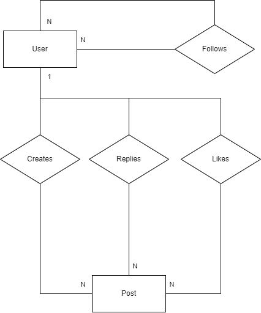

# Pyre

Projeto de uma rede social de microblog similar ao twitter,
sendo possivel criar posts, seguir usuários e ver seus posts, 
tendo um feed cronológico, com seu publico alvo sendo usuários 
de redes similares como o twitter ou o bluesky, que buscam 
alternativas a esses serviços

## Tecnlogias
### Backend

- PHP
  - Composer
  - PHPUnit
  - PDO
  - SQLite

### Frontend

- HTML
- CSS
- JS

## Diagrama ER

